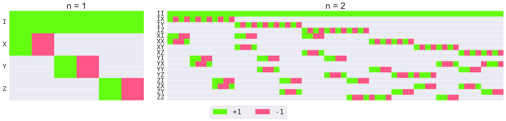

# RoM-handbook



This repository provides source code for **Robustness of Magic(RoM)** calculation, **stabilizer fidelity** (for mixed state) calculation, and **generating all the pure stabilizer states** in Pauli-basis.

This is also the supplemental material for our paper,
**"Handbook for Quantifying Robustness of Magic"**(2024) ([quantum](https://quantum-journal.org/papers/q-2024-09-05-1461/)).

## Contents

### data

The data about A matrix, which is used in naive LP (conventional method) for calculating the RoM. Please see `data/README.md` for details.

### doc

The images, tables, and source codes for the paper.
All the images in the paper are generated by the source codes in this directory.

### exputils

The Python library for RoM calculations.

## How to run the code

We require two setups to run the code.

### 1. Install the required python libraries

It is recommended that you prepare a new virtual python environment and run `pip install -r requirement.txt` to ensure that libraries are compatible.

### 2.compile C++ code

The only file written in C++ is [exputils/dot/fast_dot_products.cpp](exputils/dot/fast_dot_products.cpp),
which is the most important part of our source code with fully commented.

You need to compile the source code with the following options in the directory where the source code is located.

```bash
g++ exputils/dot/fast_dot_products.cpp -o exputils/dot/fast_dot_products.exe -std=c++17 -lz -O2 -DNDEBUG -mtune=native -march=native -fopenmp
```

The meaning of each option is as follows:

| option | meaning |
|:---|:---|
| -o | output file name |
| -std=c++17 | use C++17 |
| -lz | use zlib (to use npz files in C++)|
| -O2 | optimization level 2 (-O3 might be worse than -O2) |
| -DNDEBUG | disable assertions (if you want to debug, remove this option) |
| -mtune=native | optimize for the machine you are using |
| -march=native | optimize for the machine you are using |
| -fopenmp | use OpenMP (for parallelization) |

## Tutorial

The tutorial notebook is available at [tutorial.ipynb](tutorial.ipynb).

## License

Copyright (c) 2023 Nobuyuki Yoshioka

This project is licensed under the MIT License - see the [LICENSE](LICENSE) file for details.

## Contact

If you have any trouble, please feel free to contact us!
