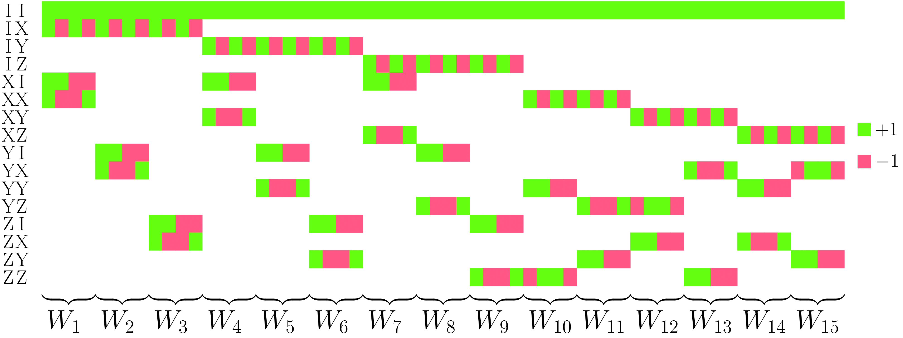

# RoM-handbook



This repository provides source code for **Robustness of Magic(RoM)** calculations.
This is also the supplemental material for our paper,
**"Handbook for Efficiently Quantifying Robustness of Magic"**(2023).

## Contents

### data

The data about A matrix. Please see `data/README.md` for details.

### doc

The images, tables, and source codes for the paper.
All the images in the paper are generated by the source codes in this directory.

### exputils

The Python library for RoM calculations.

## Getting Started

### How to use

Our source code is written in Python and C++.

#### Python

It is recommended that you prepare a new virtual python environment and run
`pip install -r requirement.txt`
to ensure that libraries are compatible.

#### C++

The only file written in C++ is [exputils/dot/fast_dot_products.cpp](exputils/dot/fast_dot_products.cpp),
which is the most important part of our source code with fully commented.

You need to compile the source code with the following options:

```bash
g++ exputils/dot/fast_dot_products.cpp -o exputils/dot/fast_dot_products.exe -std=c++17 -lz -O3 -fopenmp
```

### Tutorial

The tutorial notebook is available at [tutorial.ipynb](tutorial.ipynb).

## License

Copyright (c) 2023 Nobuyuki Yoshioka

This project is licensed under the MIT License - see the [LICENSE](LICENSE) file for details.
